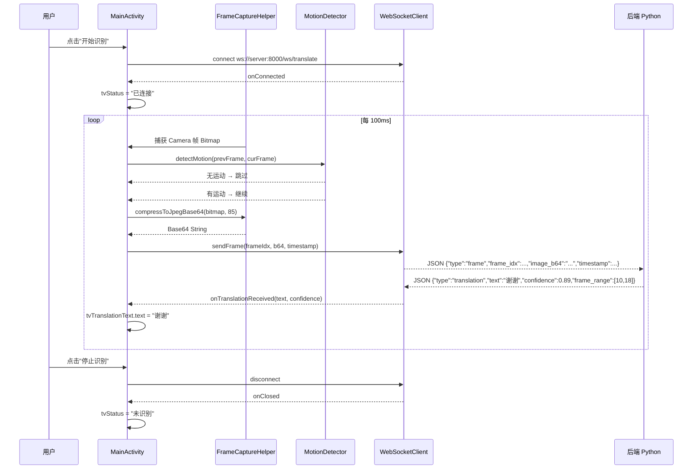
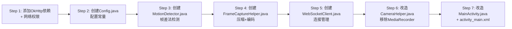

# Android 客户端改造架构设计文档

> 基于 [`结项方案.md`](../../../../wechat/xwechat_files/wxid_aehfwarrnmgm22_57d5/msg/file/2026-04/%E7%BB%93%E9%A1%B9%E6%96%B9%E6%A1%88.md)  
> 项目路径：`E:\slr_project-main\appdemo\camerarecorder`  
> 当前模式：Java + Camera2 API

---

## 一、改造目标

| 改造前（现状） | 改造后（目标） |
|:---|:---|
| 录制视频保存为 MP4 文件 | 实时抽帧 → WebSocket 推送到后端 |
| `MediaRecorder` 录制 | `ImageReader` / `TextureView.getBitmap()` 按帧采集 |
| 无网络通信 | OkHttp WebSocket 长连接 |
| 状态显示"未识别/识别中" | 状态显示"已连接/识别中"+ **翻译结果文字** |
| 视频保存在本地 | 收到的翻译结果显示在 UI 上 |

---

## 二、整体架构概览

```mermaid
flowchart TD
    A[Camera2 相机] -->|10-12 FPS 捕获| B[FrameCaptureHelper]
    B -->|Bitmap 帧| C[MotionDetector]
    C -->|静止帧| D[丢弃]
    C -->|运动帧| E[JPEG压缩 Quality=85]
    E -->|byte[]| F[Base64 编码]
    F -->|String b64| G[WebSocketClient]
    G -->|JSON frame 消息| H[(后端服务器)]
    H -->|JSON translation 消息| G
    G -->|翻译结果回调| I[MainActivity]
    I -->|更新 UI| J[tvTranslationText]
```

### 2.1 数据流时序



---

## 三、新增文件详细设计

### 3.1 `WebSocketClient.java`

**包路径**：`com.example.camerarecorder`

**职责**：管理 OkHttp WebSocket 连接、自动重连、收发 JSON 消息

**核心接口**：

```java
public interface WebSocketCallback {
    void onConnected();                      // 连接成功
    void onDisconnected(int code, String reason);  // 断开
    void onTranslationReceived(String text, float confidence, int[] frameRange); // 收到翻译结果
    void onStatusReceived(float gpuUtil, float latencyMs); // 收到服务器状态
    void onError(String error);              // 错误
}

public class WebSocketClient {
    public WebSocketClient(String serverUrl, WebSocketCallback callback);
    public void connect();                    // 建立连接
    public void disconnect();                 // 主动断开
    public boolean isConnected();             // 连接状态
    public void sendFrame(int frameIdx, String base64Image, long timestamp); // 发送帧
}
```

**发送消息格式**（上行）：

```json
{
  "type": "frame",
  "frame_idx": 12,
  "image_b64": "/9j/4AAQ...",
  "timestamp": 1712345678123
}
```

**接收消息处理**（下行，根据 `type` 字段分发）：

| type | 处理逻辑 |
|:---|:---|
| `"translation"` | 回调 `onTranslationReceived` → 更新 UI |
| `"status"` | 回调 `onStatusReceived` → 可选显示 |
| `"error"` | 回调 `onError` → Toast 提示 |

**自动重连策略**：

```
断开 → 等待 3 秒 → 重试连接 → 成功/失败
                               ↓ 失败
                          重复最多 5 次
```

### 3.2 `FrameCaptureHelper.java`

**包路径**：`com.example.camerarecorder`

**职责**：从 Camera2 获取帧数据，JPEG 压缩，Base64 编码

**核心逻辑**：

```java
public class FrameCaptureHelper {
    // 从 TextureView 捕获当前显示的 Bitmap
    public Bitmap captureFrame(TextureView textureView);
    
    // 将 Bitmap 压缩为 JPEG Quality=85 并编码为 Base64
    public String compressToBase64(Bitmap bitmap, int quality);
    
    // 估算 Base64 字符串长度以判断是否需要降分辨率
    public boolean isTooLarge(String base64, int maxKb);
}
```

**压缩流程**：

```
Bitmap (原始, 可能 1920x1080)
    ↓ 缩放（若分辨率过高，缩放到 640x480）
    ↓ JPEG 压缩 (Quality=85)
    ↓ ByteArrayOutputStream → byte[]
    ↓ Base64.encodeToString(byte[], Base64.NO_WRAP)
    ↓ String （发送到 WebSocket）
```

**分辨率降级策略**（避免 Base64 过大）：

| 原始分辨率 | 缩放目标 | 预估 Base64 大小 |
|:---|:---|:---|
| 1920x1080 | 640x480 | ~50-70 KB |
| 1280x720 | 640x480 | ~40-60 KB |
| 640x480 | 保持 | ~30-50 KB |

### 3.3 `MotionDetector.java`

**包路径**：`com.example.camerarecorder`

**职责**：帧差法检测画面变化，过滤静止帧

**核心逻辑**：

```java
public class MotionDetector {
    private Bitmap previousFrame;    // 上一帧灰度图
    private static final float THRESHOLD = 0.05f;  // 运动阈值 5%
    
    // 检测当前帧是否包含显著运动
    // 返回 true = 有运动（需要上传）
    // 返回 false = 静止（丢弃）
    public boolean detectMotion(Bitmap currentFrame);
    
    // 重置（切换摄像头时调用）
    public void reset();
    
    // 调整灵敏度
    public void setThreshold(float threshold);
}
```

**帧差法实现步骤**：

```
1. 将当前 Bitmap 缩放到 32x24 像素（极小尺寸，加速计算）
2. 转换为灰度 [0-255]
3. 与上一帧的灰度值逐个像素求差
4. 计算像素差异 > 30 的像素占比
5. 若占比 > 5%（THRESHOLD），判定为"有运动"
6. 更新 previousFrame = 当前帧灰度图
```

---

## 四、现有文件修改方案

### 4.1 `MainActivity.java` — 主要修改

| 改动点 | 说明 |
|:---|:---|
| **新增成员变量** | `WebSocketClient`、`FrameCaptureHelper`、`MotionDetector`、`frameIdx` 计数器、`tvTranslation`（翻译结果 TextView） |
| **新增 `TextView tvTranslation`** | 显示后端返回的翻译结果 |
| **修改 `toggleRecording()`** | 改为 `toggleRecognition()` — 开始/停止实时识别 |
| **`btnRecord` 点击** | 开始：建立 WS 连接 + 启动定时抽帧；停止：停止抽帧 + 断开 WS |
| **新增定时器** | `Handler.postDelayed` 每 100ms 执行：捕获帧 → 运动检测 → 压缩 → 发送 |
| **实现 `WebSocketCallback`** | 处理 `onTranslationReceived` 更新 UI 文字 |
| **`onResume` / `onPause`** | 生命周期管理，断开 WS 连接 |

**按钮语义变更**（已有 UI 布局不需要大改，只需改状态文字）：

```
录制按钮: "开始录像" → "开始识别"
状态文字: "未识别" / "识别中" → "未连接" / "已连接" / "识别中"
新增文字: 翻译结果（大号居中显示）
```

### 4.2 `activity_main.xml` — 布局修改

在现有布局基础上，在相机预览区域**新增一个用于展示翻译结果的 TextView**：

```xml
<!-- 在 tvStatus 下方或覆盖层添加 -->
<TextView
    android:id="@+id/tvTranslation"
    android:layout_width="wrap_content"
    android:layout_height="wrap_content"
    android:layout_gravity="center"
    android:textSize="28sp"
    android:textColor="@android:color/white"
    android:textStyle="bold"
    android:shadowColor="#FF000000"
    android:shadowRadius="4"
    android:background="#66000000"
    android:padding="16dp"
    android:text="等待识别..." />
```

**注意**：不需要大幅度修改布局，仅新增一个文字展示层即可。现有底部控制按钮保持不变。

### 4.3 `CameraHelper.java` — 改造方案

当前 `CameraHelper` 包含 `MediaRecorder` 录制逻辑，改造后需要：

| 操作 | 说明 |
|:---|:---|
| **移除** `MediaRecorder` 相关代码 | `mediaRecorder` 变量、`setupMediaRecorder()`、录制状态 |
| **保留** Camera2 预览逻辑 | `openCamera()`、`createPreviewSession()`、`configureTransform()` |
| **可选新增** `ImageReader` | 如果想精确控制抽帧，可新增 `ImageReader` 输出 |
| **简化** `RecordingListener` | 改为 `RecognitionListener` 回调 |

**关键决定**：帧捕获方式有两种选择，推荐 **方案A**：

| 方案 | 方式 | 优点 | 缺点 |
|:---|:---|:---|:---|
| **A（推荐）** | `TextureView.getBitmap()` | 实现简单，无需修改 Camera2 配置 | 性能略低（但 10 FPS 足够） |
| **B** | `ImageReader` 接收 YUV 帧 | 性能更好，可获取原始数据 | 需修改 Camera2 创建预览的代码 |

采用方案A，`CameraHelper` 只需移除 MediaRecorder 相关代码，保留预览功能即可。

### 4.4 `build.gradle.kts` — 新增依赖

在 `dependencies` 块中添加：

```kotlin
dependencies {
    // ... 现有依赖 ...
    
    // OkHttp WebSocket 客户端
    implementation("com.squareup.okhttp3:okhttp:4.12.0")
}
```

### 4.5 `AndroidManifest.xml` — 新增权限

```xml
<!-- 网络权限 -->
<uses-permission android:name="android.permission.INTERNET" />
<uses-permission android:name="android.permission.ACCESS_NETWORK_STATE" />
```

---

## 五、后端接口协议完整参考

### 5.1 WebSocket 端点

| 项目 | 值 |
|:---|:---|
| URL | `ws://{server_ip}:8000/ws/translate` |
| 协议 | WebSocket (RFC 6455) |
| 编码 | UTF-8 JSON |

### 5.2 上行消息（Android → 后端）

```
type: "frame"
```

| 字段 | 类型 | 必填 | 说明 |
|:---|:---|:---|:---|
| `type` | String | ✅ | `"frame"` |
| `frame_idx` | int | ✅ | 从 0 递增 |
| `image_b64` | String | ✅ | JPEG Quality=85 的 Base64 |
| `timestamp` | long | ✅ | System.currentTimeMillis() |

```
type: "control"
```

| 字段 | 类型 | 必填 | 说明 |
|:---|:---|:---|:---|
| `type` | String | ✅ | `"control"` |
| `action` | String | ✅ | `"start"` 或 `"stop"` |

### 5.3 下行消息（后端 → Android）

```
type: "translation"
```

| 字段 | 类型 | 必填 | 说明 |
|:---|:---|:---|:---|
| `type` | String | ✅ | `"translation"` |
| `text` | String | ✅ | 翻译结果中文 |
| `confidence` | float | ✅ | 0~1 |
| `frame_range` | [int,int] | ❌ | 帧区间 |

```
type: "status"
```

| 字段 | 类型 | 必填 | 说明 |
|:---|:---|:---|:---|
| `type` | String | ✅ | `"status"` |
| `gpu_util` | float | ❌ | GPU 利用率 |
| `latency_ms` | float | ❌ | 端到端延迟 |
| `fps` | float | ❌ | 处理帧率 |

---

## 六、配置常量建议

在 `MainActivity` 或独立 `Config.java` 中定义：

```java
public class Config {
    // WebSocket 服务器地址（部署时根据实际 IP 修改）
    public static final String WS_URL = "ws://192.168.1.100:8000/ws/translate";
    
    // 抽帧参数
    public static final int CAPTURE_INTERVAL_MS = 100;   // 10 FPS
    public static final int JPEG_QUALITY = 85;
    public static final int MAX_FRAME_WIDTH = 640;
    public static final int MAX_FRAME_HEIGHT = 480;
    
    // 运动检测参数
    public static final float MOTION_THRESHOLD = 0.05f;  // 5%
    public static final int SCALE_SIZE = 32;              // 缩放到 32x24 做检测
    
    // WebSocket 重连
    public static final int RECONNECT_DELAY_MS = 3000;
    public static final int MAX_RECONNECT_ATTEMPTS = 5;
}
```

---

## 七、新增文件清单与代码大小预估

| 文件名 | 文件路径 | 预估行数 | 复杂度 |
|:---|:---|:---|:---|
| [`WebSocketClient.java`](file:///e:/slr_project-main/appdemo/camerarecorder/app/src/main/java/com/example/camerarecorder/WebSocketClient.java) | `app/src/main/java/com/example/camerarecorder/` | ~150 行 | ⭐⭐ |
| [`FrameCaptureHelper.java`](file:///e:/slr_project-main/appdemo/camerarecorder/app/src/main/java/com/example/camerarecorder/FrameCaptureHelper.java) | 同上 | ~80 行 | ⭐ |
| [`MotionDetector.java`](file:///e:/slr_project-main/appdemo/camerarecorder/app/src/main/java/com/example/camerarecorder/MotionDetector.java) | 同上 | ~80 行 | ⭐⭐ |
| [`Config.java`](file:///e:/slr_project-main/appdemo/camerarecorder/app/src/main/java/com/example/camerarecorder/Config.java) | 同上 | ~30 行 | ⭐ |

### 需修改的现有文件

| 文件名 | 修改范围 | 预估行数变更 |
|:---|:---|:---|
| [`MainActivity.java`](file:///e:/slr_project-main/appdemo/camerarecorder/app/src/main/java/com/example/camerarecorder/MainActivity.java) | 重构录制逻辑为识别逻辑，新增回调处理 | ~150 行新增，~50 行删除 |
| [`CameraHelper.java`](file:///e:/slr_project-main/appdemo/camerarecorder/app/src/main/java/com/example/camerarecorder/CameraHelper.java) | 移除 MediaRecorder 相关 | ~200 行删除 |
| [`activity_main.xml`](file:///e:/slr_project-main/appdemo/camerarecorder/app/src/main/res/layout/activity_main.xml) | 新增翻译结果 TextView | ~10 行新增 |
| [`build.gradle.kts`](file:///e:/slr_project-main/appdemo/camerarecorder/app/build.gradle.kts) | 添加 OkHttp 依赖 | 1 行新增 |
| [`AndroidManifest.xml`](file:///e:/slr_project-main/appdemo/camerarecorder/app/src/main/AndroidManifest.xml) | 添加网络权限 | 2 行新增 |

---

## 八、实现步骤建议

建议按以下顺序实施改造，每个步骤可独立验证：



### 各步骤验证点

| 步骤 | 验证方法 |
|:---|:---|
| Step 1-2 | `gradle sync` 成功，无编译错误 |
| Step 3 | 单元测试：传入两张不同图片，确认 `detectMotion` 正确返回 true/false |
| Step 4 | 捕获一帧 → 确认输出了合法的 Base64 字符串 → 用在线工具解码验证图片 |
| Step 5 | 连接测试 WebSocket 服务器（可用 `wscat` 模拟），确认收发正常 |
| Step 6 | 相机预览正常显示，无 MediaRecorder 错误 |
| Step 7 | 全流程：点击"开始识别"→ 相机预览 → 抽帧发送 → 收到翻译结果 → UI 更新 |

---

## 九、风险与注意事项

| 风险 | 应对 |
|:---|:---|
| **Base64 体积过大** | 发送前控制图片分辨率 ≤ 640x480，JPEG Quality=85，预估单帧 ~50KB |
| **WebSocket 频繁断开** | 实现指数退避重连，并在 UI 显示连接状态 |
| **UI 线程卡顿** | 帧捕获、压缩、编解码全部在 **后台线程** 执行，仅 UI 更新在主线程 |
| **Camera2 与抽帧冲突** | 使用 `TextureView.getBitmap()` 不影响 Camera2 预览，最简单可靠 |
| **Android 后台限制** | Android 10+ 后台启动 Activity 受限，保持在前台运行即可 |
| **旧代码残留** | 确保 `MediaRecorder` 相关代码完全移除，否则可能占用了摄像头资源 |
